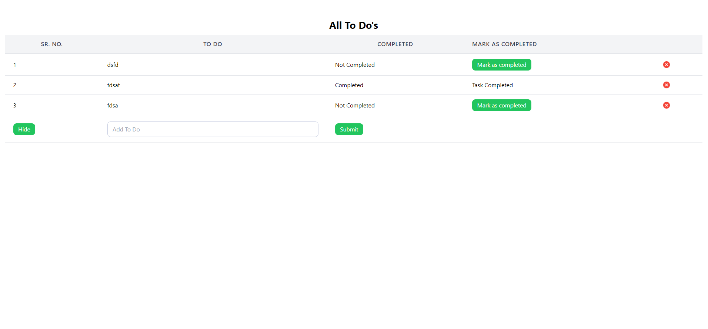
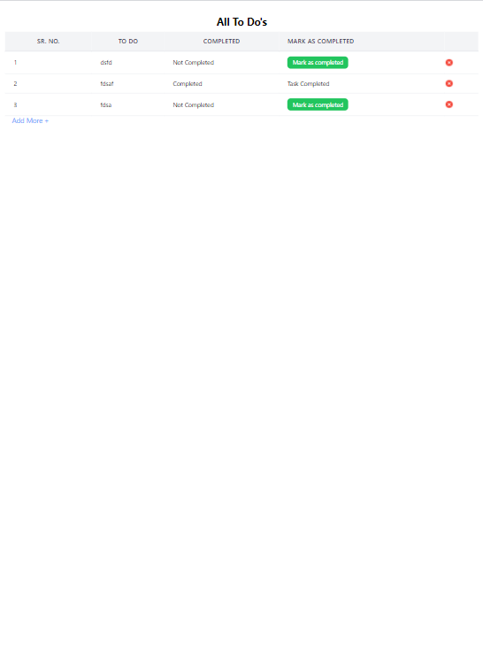
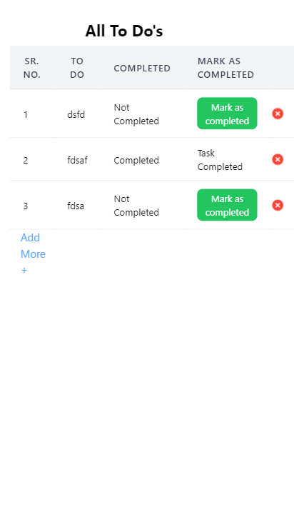

# QuadB ReactJs Internship Assignment

This is the assignment for Reactjs Internship Application at QuadB.

### Installation and Usage

To run this website locally, you need to have Node.js and npm installed on your machine. Then follow these steps:

- Clone this repository to your local machine: git clone https://github.com/ayannafees/QuadB_Assignment.git

- Navigate to the project folder: cd quadbassignment

- Install the required packages: npm install

- Start the development server: npm start

- Open your browser and go to http://localhost:3000

### Screenshots
#### Laptop

#### Tablet

#### Mobile

### Contributors

This project was created by Ayan Nafees as an assignment for ReactJs internship application at QuadB. You can contact him at ayan014iiitm@gmail.com or visit his LinkedIn page at ( https://www.linkedin.com/in/ayannafees/ )

